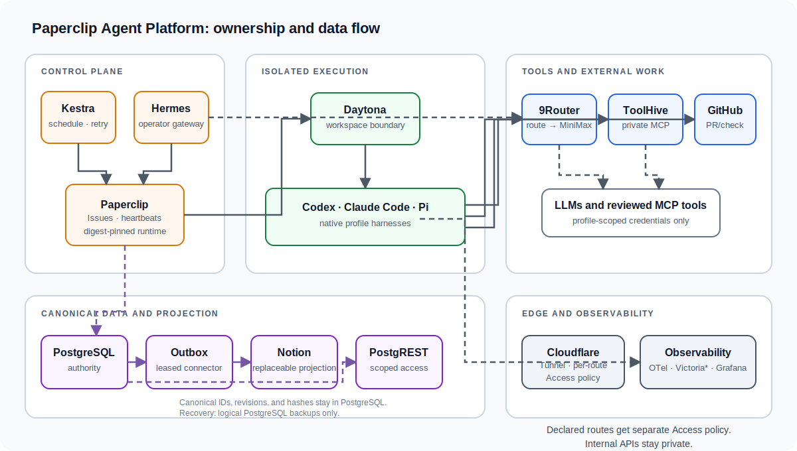
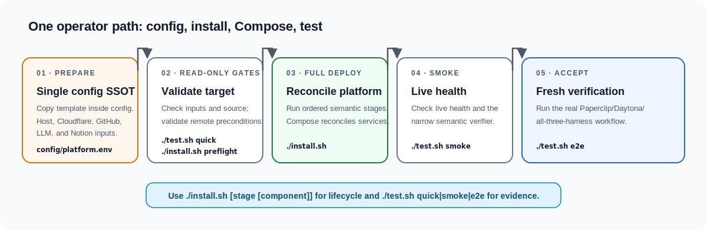

# Paperclip Agent Platform

Self-hosted control and execution platform for long-running AI-agent work. It
keeps workflow, task, execution, data, edge, and observability ownership
separate, and installs them through one transparent shell index backed by
Docker Compose.



This is an ownership map, not a deployment-status view. The routed
[`system-platform` documentation](skills/system-platform/SKILL.md) is the
operator reference; generated acceptance evidence is the only readiness source.

## Start here

This is infrastructure for a dedicated Linux host, not an application template.
Before starting, have an Ubuntu 24.04 host reachable as root over SSH, a
Cloudflare-managed DNS zone, and a workstation with Python 3.11+, the packages
in `tools/platform-cli/requirements-release-check.txt`, `bash`, `ssh`, `rsync`,
and `curl`. The installer adds Docker Engine and Compose on the target when
absent. The launcher reports the exact hash-locked install command if those
Python packages are missing or version-mismatched; it does not create a virtual
environment. `.runtime` remains active generated runtime and evidence state;
the removed hidden virtual-environment/bootstrap lifecycle neither owns nor
automatically deletes it.

Get a clean checkout and run the local source gate first:

```bash
git clone <repository-url> paperclip-agent-platform
cd paperclip-agent-platform
./test.sh quick
```

Create the one private environment file. `config/platform.env` is ignored by
Git, is the single operator-editable source of truth, and must never be
committed. The installer imports it fill-only into a root-owned server runtime
materialization; that server file is not a second operator input.

```bash
cp config/platform.env.example config/platform.env
chmod 600 config/platform.env
# Replace every example value, then:
./install.sh preflight
```

Prepare these input categories in that private file. Use the exact documented
key names in [`config/platform.env.example`](config/platform.env.example), but
never put their values in Git, commands, issues, logs, or evidence.

| Category | What the operator supplies |
| --- | --- |
| Host and DNS | SSH target, operator network allow-list, excluded hosts, base domain |
| Resource admission | Non-secret minimum RAM/disk and maximum swap/load thresholds; checked before deployment and before a live Daytona E2E canary |
| Cloudflare edge | account ID, account email, global API key used only to bootstrap a scoped token |
| GitHub E2E | token plus owner, repository, and base branch for the disposable canary lifecycle |
| LLM provider | Root-only MiniMax API key, base URL, and model; 9Router retains the upstream credential and routes profile-scoped runtime keys |
| Data projection | Notion token and root page ID; PostgreSQL remains the authority |
| Mandatory release consent | `MTE_ENABLE_OPERATOR_PROVIDED_PROPRIETARY_HARNESSES=true` explicitly authorizes the supported Codex and Claude Code harness installation; the checked-in default fails closed |
| Optional integrations | Context7 API key and Hermes Telegram bot token/user allow-list |

Paperclip, Daytona, 9Router, ToolHive, Postgres/PostgREST, service passwords,
and profile-specific secret references are provisioned or generated by the
platform. Do not pre-create shared runtime keys or hand-edit rendered service
files. Codex, Claude Code, and Pi receive a profile-scoped 9Router route, not
direct OpenAI or Anthropic subscription authentication or API credentials.
The proprietary-harness consent is a mandatory release decision, not an
optional integration: deployment stops before installing Codex or Claude Code
unless the operator has set that flag to `true` in the private input file.

## Deploy, inspect, and accept

For an ordinary new host, the complete incremental deployment is one command:

```bash
./install.sh
```

This repository ships no generic legacy-takeover or data-migration runner. For
an existing host, stop before `./install.sh` and use an operator-specific,
privately reviewed runbook with a proven backup and recovery path. Do not copy
host data into this repository or use a generic command to convert it.

The only lifecycle interface is `./install.sh [stage [component]]`.
`install.sh` contains the only stage order:

```bash
preflight → host → compose → provision → cloudflare → verify
```

The preflight stage proves the remote Ubuntu identity, then applies the
canonical read-only resource policy before host bootstrap can mutate the
machine. Docker storage is inspected when Docker already exists, but Docker is
not required on a clean deployment host. Thresholds live in the canonical
environment contract; the shipped defaults require 20 GiB total RAM, 6 GiB
available RAM, no more than 1 GiB swap in use, load at most 1.5 per online CPU,
and 30 GiB free on both `/` and Docker's filesystem. Before a live Daytona E2E
canary, Docker is required and the same six-key policy reserves another 2 GiB
of available RAM for one coding sandbox plus 10 GiB on Docker's filesystem for
the immutable image pull. These E2E reserves are derived, not operator inputs.

The Cloudflare stage is fail-closed: it creates and verifies Access
applications before publishing their DNS records. Each service-class route
(including 9Router, ToolHive, PostgREST, and Firecrawl in the shipped profile)
has its own generated Access service token and policy. A token for one route
is intentionally rejected by every other route; credentials remain in the
root-only canonical secret store and are never declared in repository config.
The C029 persistence gate likewise accepts only fresh, hash-bound receipts from
the `server-notion-sync.py` projection consumer: both its live canary and its
post-canary consumer verification are required.

## Recovery and retirement boundary

The first public recovery surface is intentionally narrow and uses standard
Compose and PostgreSQL tools:

```bash
./install.sh backup release-2026-07-20
./install.sh restore release-2026-07-20 --confirm-restore
./install.sh decommission --confirm-decommission
```

`backup` quiesces database clients and creates an idempotent, checksummed
host-local logical dump set for the four aggregate Compose PostgreSQL services
and Daytona PostgreSQL. `restore` validates identity, archives, versions, and
connectivity, then captures verified rollback dumps before replacing those
databases. `decommission` removes platform containers while preserving all
named volumes, backup sets, Cloudflare resources, and credentials.

This is not disaster recovery: Paperclip's native embedded PostgreSQL and all
non-database volume payloads are inventoried but not captured or restored.
PITR, off-host backup targets, automatic backup pruning/rotation, encryption,
volume archive restore, external-resource retirement, and generic downgrade
are unsupported and must not be inferred from these commands. Restore does
provide a verified pre-restore logical rollback. See [backup, restore, upgrade,
and rollback](skills/system-platform/references/backup-upgrade.md) for the exact
boundary and the required live proof before production reliance.



Docker Compose pulls official digest-pinned images, creates networks and
volumes, and incrementally reconciles only changed services. Provisioning then
creates accounts, scoped secrets, profiles, workflows, and service bindings.
The final stage runs the real Kestra/Paperclip/Daytona harness and connection
acceptance. Healthy containers or local unit tests alone are not completion.

```bash
./install.sh compose firecrawl
./install.sh provision kestra
./test.sh smoke firecrawl
./test.sh e2e
```

## What owns what

| Plane | Owner |
| --- | --- |
| Workflow | Kestra schedules, branching, retries, and approval stages |
| Agent tasks | Paperclip Issues, assignment, heartbeats, messages, and run status |
| Execution | Daytona isolated workspaces running Codex, Claude Code, or Pi |
| LLM and tools | 9Router profile routes and ToolHive profile-private MCP aggregates |
| Data | PostgreSQL authority, scoped PostgREST access, and a replaceable Notion projection |
| Operations | Hermes native operator, Cloudflare Tunnel/Access, and OpenTelemetry with Victoria* and Grafana/Alertmanager |

GitHub is the checked end-to-end work-product path. Firecrawl and SearXNG are
shipped research services. Activepieces is **not** shipped; additional content
or automation providers must be added as explicit connector packages without
changing PostgreSQL ownership. The shipped runnable Paperclip catalog contains
only the three Daytona coding profiles (Codex, Claude Code, and Pi). Research,
content-publishing, and operations profiles are future catalog extensions, not
currently runnable shipped profiles.

## Further operator documentation

Keep this README as the entry point. The complete, routed operator reference is
the [`system-platform` skill](skills/system-platform/SKILL.md), including
installation, operations, troubleshooting, security, connections, agent
runtime, and architecture details. Read its [known limitations](skills/system-platform/references/known-limitations.md)
before production use.

Project participation and release entrypoints are deliberately thin:
[contributing](CONTRIBUTING.md), [security reporting](SECURITY.md),
[code of conduct](CODE_OF_CONDUCT.md), and [changelog](CHANGELOG.md) all route
to the current skill and machine-readable contracts rather than duplicating
operator instructions.

`./test.sh quick` is the fast offline gate; `make release-check` remains the
complete source gate. Small Python utilities under `tools/platform-cli` render
canonical configuration, transfer staged assets, reconcile service APIs, and
produce acceptance evidence. They do not own lifecycle ordering: the shell
installer above is the single deployment entry point. The repository is not
published as a Python wheel. Licensed under
the terms in [LICENSE](LICENSE); see the [third-party notice](skills/system-platform/references/third-party.md).
